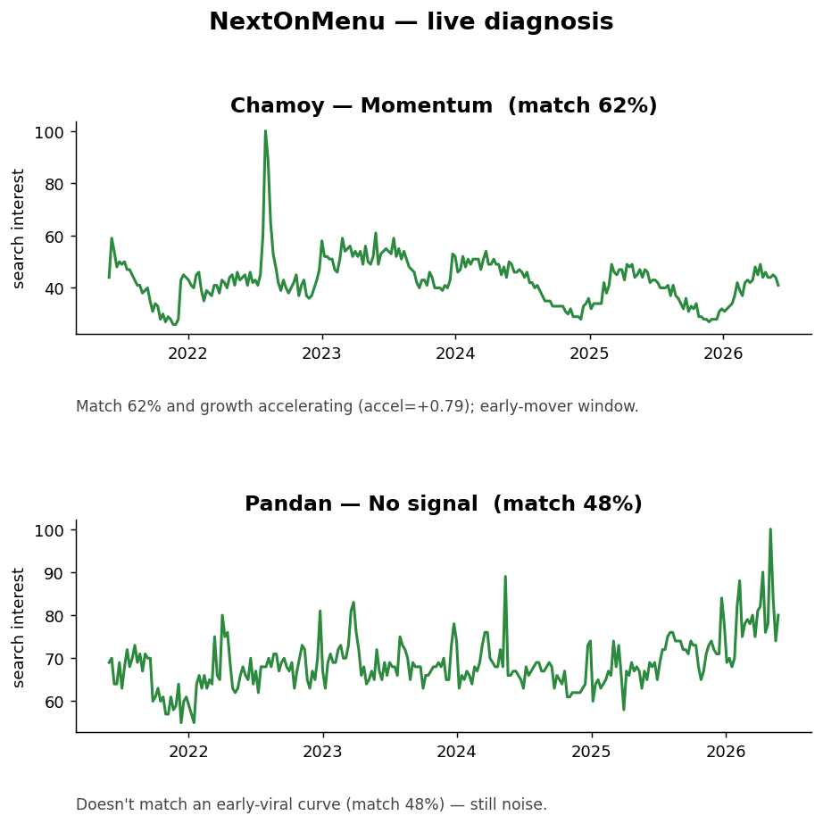

# NextOnMenu

NextOnMenu looks for an entropy/growth pattern in Google Trends data that tends to show up before a food ingredient breaks out. It's a pattern detector, so it flags a shape it recognizes. It does not predict that any given ingredient will go mainstream. I tested it against real ingredients that organized and rose and then fizzled, and it still false-alarms on about a third of them (specificity 0.65). So it's radar with a noise level I actually measured, not a crystal ball.



*Live diagnosis output. Chamoy reads as **Momentum** (accelerating and pre-peak, the early-mover window). Pandan sits just under the line at **No signal**, which is the conservative call on a curve the model isn't sold on yet.*

## Data provenance

Every model input is real Google Trends data, cached as CSVs in `data/raw/`. The headline result (logistic regression, 0.70 leave-one-ingredient-out accuracy, now with real non-breakout ingredients in the negative class) uses no synthetic data at all (`src/experiment.py`, `run_lr_loo`). The only place synthesis shows up is label-preserving augmentation (small jitter, amplitude scale, time-shift) for training the 1D-CNN comparison model (`src/sequences.py`). That augmentation runs inside each training fold only, never on the held-out ingredient (`src/experiment.py`), so it can't leak. The CNN also didn't beat the baseline, so it isn't behind the headline number anyway. Reproduce the headline in five seconds:

```bash
python -c "from src.experiment import run_lr_loo; acc,prec,rec,spec,fpr=run_lr_loo(); print(f'LR LOO acc={acc:.3f} specificity={spec:.3f}')"
# -> LR LOO acc=0.700 specificity=0.650
```

## Setup

```bash
python3 -m venv .venv && source .venv/bin/activate
pip install -r requirements.txt
```

## Pipeline

```bash
python -m src.features   # fetch + build data/processed/features.csv
python -m src.train      # train + leave-one-ingredient-out eval, writes model.pkl
python app.py            # launch the Gradio demo
```

## How it works

1. **Fetch.** Google Trends data for ingredients that already went viral (`src/fetch.py`).
2. **Window.** For each one I slice the early-curve window (the positive example), plus its flat pre-niche era and its post-peak plateau (the negatives) (`src/features.py`). The negative class also includes the early-rise windows of non-breakout ingredients, which are genuine "rose then fizzled" hard negatives, via `NON_BREAKOUT_INGREDIENTS` and `slice_non_breakout_window` in `src/features.py`.
3. **Features.** Growth (1-year rate, baseline, peak-not-hit) and entropy (geographic, temporal, 6-month delta). I compute the short-term growth rate and acceleration too, but the model drops them: all three growth features correlate at r = 0.98 to 0.99, and keeping just the 1-year rate removes that redundancy (it nudges accuracy up and keeps the coefficients readable).
4. **Train.** Logistic regression, evaluated with leave-one-ingredient-out CV so the score reflects judging an unseen ingredient instead of memorizing a known one (`src/train.py`).
5. **Diagnose.** Fetch an ingredient live, map the model output to a lifecycle stage (`src/diagnose.py`), shown in a Gradio UI (`app.py`).

## Stages

- **No signal.** Still noise.
- **Stage 1, Entropy Drop.** Interest is organizing, worth watching.
- **Stage 2, Momentum.** Growth is accelerating, early-mover window.
- **Stage 3, Resonance.** Broad accelerating signal, mainstream incoming.

## Phase 2: the 1D-CNN experiment

I wanted to know whether a small 1D-CNN reading the raw trend curve could beat the logistic-regression baseline, judged under the same leave-one-ingredient-out evaluation on the same 30 ingredients / 60 windows. Augmentation (jitter, scaling, time-shift) ran inside each training fold only, never on the held-out ingredient, so the comparison stays leakage-free. Reproduce it with `python -m src.experiment`.

| Model               | accuracy | precision | recall | specificity | fp_rate |
| ------------------- | -------- | --------- | ------ | ----------- | ------- |
| Logistic Regression | 0.70     | 0.53      | 0.80   | 0.65        | 0.35    |
| 1D-CNN (augmented)  | 0.63     | 0.47      | 0.75   | 0.58        | 0.42    |

**Finding:** the CNN didn't beat the baseline (0.63 vs 0.70). On 60 windows from 30 ingredients, even with augmentation, the deep model has too little data to gain an edge. That's a real result and I'm leaving it as-is. On small, noisy trend data the simple interpretable model holds up, and I didn't tune the CNN against the test folds to fake a win. Getting meaningfully past the target probably needs richer features or more ingredients, not a fancier model. The learning curve in `notebooks/analysis.ipynb` shows where accuracy levels off.

## Limitations

These numbers come from 30 ingredients / 60 windows, which is small, so read them as directional rather than precise:

- **Specificity is the caveat that matters, more than accuracy.** The negative class now includes the early-rise windows of 10 ingredients that organized but never crossed to mainstream (`NON_BREAKOUT_INGREDIENTS`). Against those real non-breakouts the model's specificity is 0.65, so it still false-alarms on ~35% of them (14 false positives out of 30 negatives; confusion matrix [[26 14],[4 16]]). Earlier versions never tested this case (negatives were only winners' flat/post-peak phases), so the old precision looked better than the detector really is. The false-alarm rate is the number to watch.
- **The 0.70 is mildly optimistic.** I iterated on the dataset and features while checking the same leave-one-ingredient-out holdout, so the model has implicitly fit to that particular set. A fresh batch of ingredients would give a cleaner estimate.
- **Small differences aren't significant.** The score wobbles by roughly plus or minus 0.02 to 0.03 fold to fold, so read 0.70 vs the CNN's 0.63 with that noise in mind. I can say the CNN didn't beat the baseline; I'm not claiming hair-thin margins as hard facts.
- **The labels are human judgment.** Which ingredients "went viral" and which months count as the "early curve" were my calls. Defensible and applied consistently, but not ground truth.

The process is sound (no leakage, real holdout, results reported as-is). The conclusions are directional.

## Data limitations (Google Trends artifacts)

The input is Google Trends' normalized 0 to 100 relative interest index, not raw counts (Google doesn't expose counts). Four known artifacts affect the signal, and I'd rather disclose them than quietly paper over them:

- **Low-volume quantization.** Early sparse data gets coarsely rounded toward 0/1, which reads as "organized" (low entropy) almost by default, and entropy drifts upward over 2004 to 2024 as volume grows. I haven't detrended for this yet. It's the clearest next experiment.
- **Per-window rescale-to-peak.** Region fetches in `build_dataset` call `build_payload` with a different timeframe per window, so Google rescales each window to its own max of 100, and I then treat them as comparable. I haven't re-stitched windows onto a common timeframe yet (that means re-fetching and renormalizing every ingredient).
- **Sampling wobble.** One fetch per ingredient. Google returns slightly different numbers per request and I don't average across repeated queries.
- **Variance vs entropy confound.** Histogram-Shannon `temporal_entropy` mostly tracks spread, so a low-variance plateau mechanically produces an entropy dip. I compute `sample_entropy` (a less variance-driven estimate) and store it in `features.csv` as a candidate. It's not a model input yet, and it saturates on the short 24-row windows I use, so it needs re-validation before I'd promote it.

## Notes

- pytrends gets rate-limited or blocked fairly often. Fetches are cached to `data/raw/`, so re-runs are incremental. If you get blocked, set a valid `NID` browser cookie via the `TRENDS_NID` env var, or export CSVs manually from trends.google.com to the path named in the error and re-run.
- Phase 1 is the logistic-regression baseline (`src/train.py`). Phase 2 is the 1D-CNN experiment (`src/sequences.py`, `src/cnn.py`, `src/experiment.py`). It's an offline comparison and isn't wired into the live demo, since it didn't beat the baseline.
